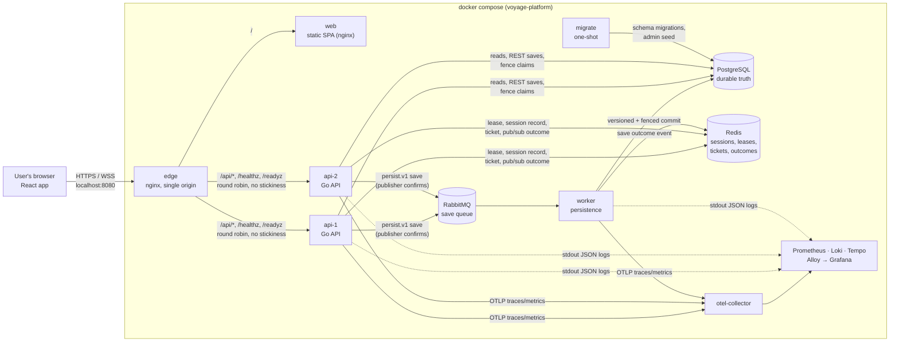
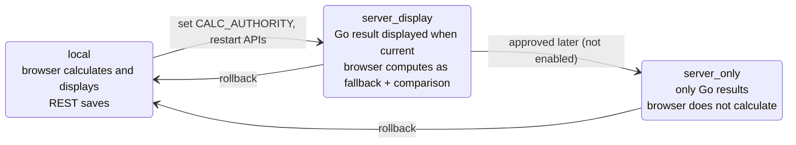
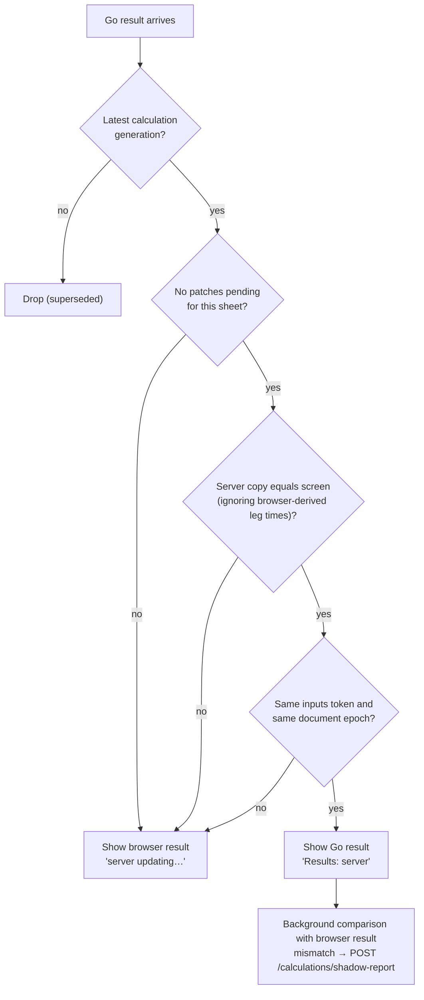
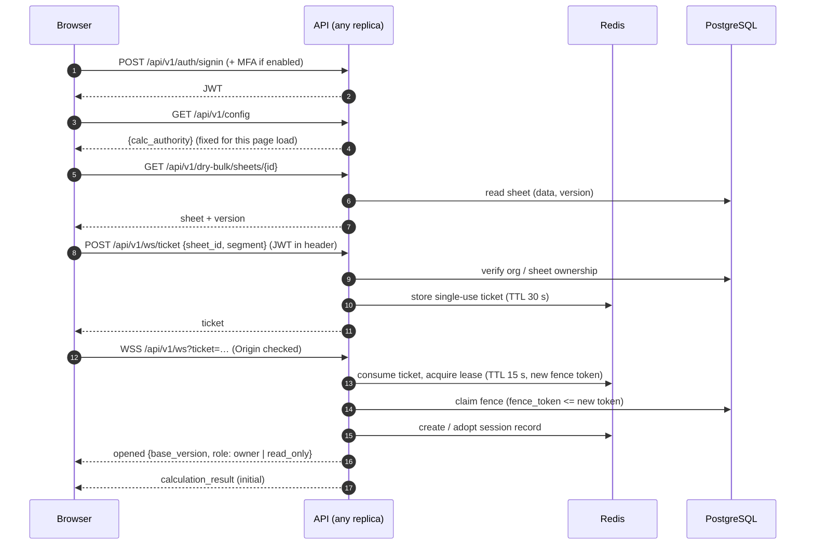
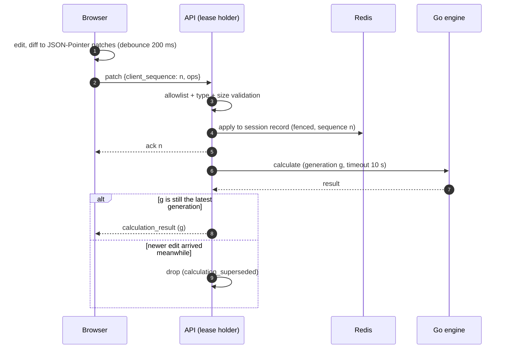
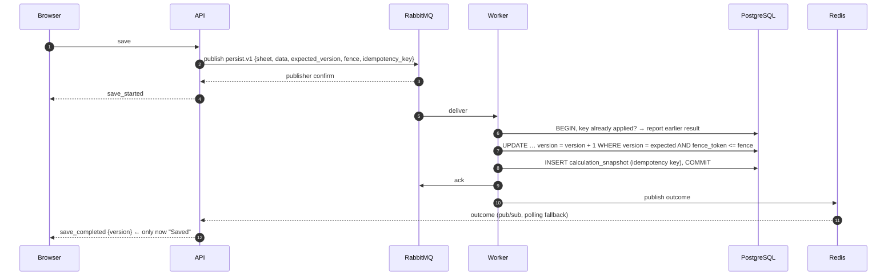
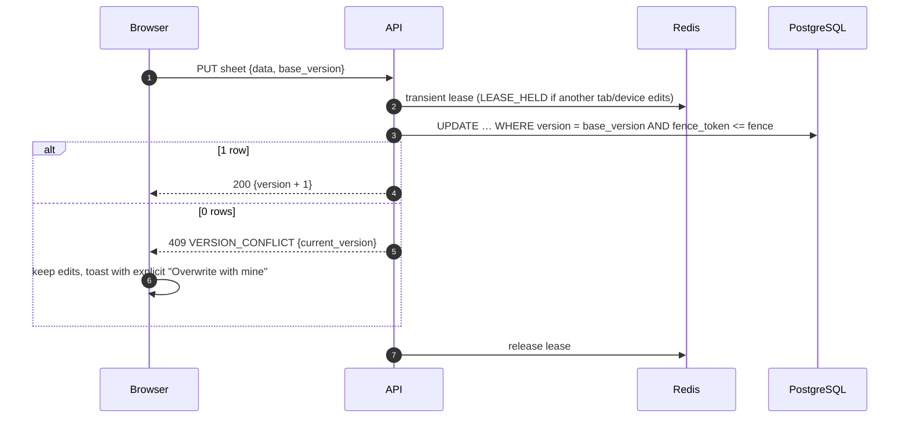
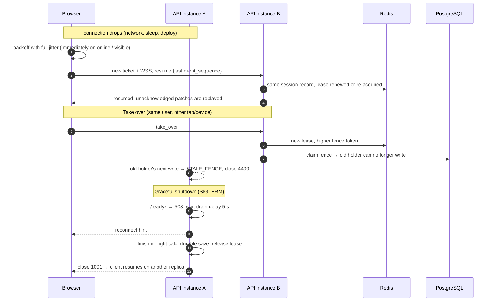
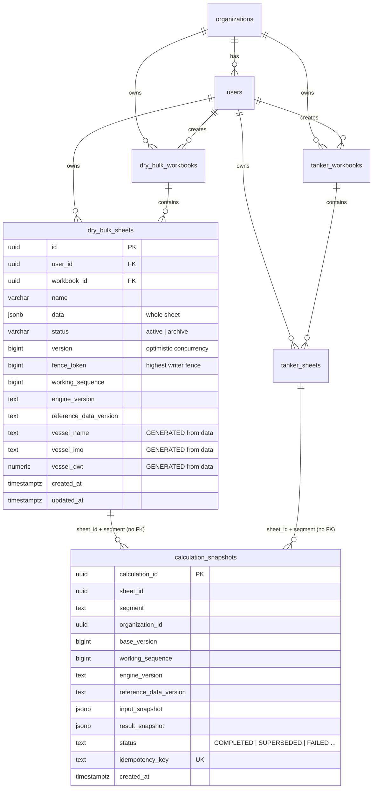
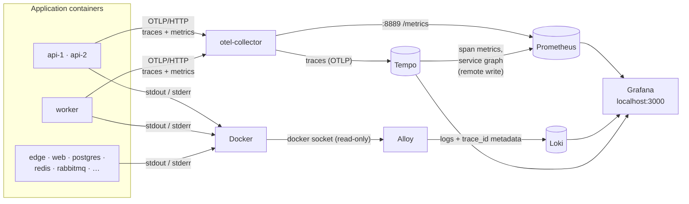

# Voyage Platform — Architecture

This document describes how the platform (NM-backend and NM-frontend, run by this NM-Deploy repo) works end to end, as implemented: components, the main
flows (with diagrams), the data model, timings and limits, edge cases and how each is handled, security,
observability, and the known limitations.

Diagrams are Mermaid; they render on GitHub, GitLab and in VS Code (Markdown preview with Mermaid support).
Decision numbers (D-nnn) refer to [NM-backend/docs/migration/DECISIONS.md](../NM-backend/docs/migration/DECISIONS.md).
Deeper per-topic docs live in [NM-backend/docs/](../NM-backend/docs/).

Contents

1. [System overview](#1-system-overview)
2. [Who owns what](#2-who-owns-what)
3. [Calculation authority stages](#3-calculation-authority-stages)
4. [Flows](#4-flows)
5. [Data model](#5-data-model)
6. [Timings and limits](#6-timings-and-limits)
7. [Edge cases](#7-edge-cases)
8. [Security](#8-security)
9. [Observability](#9-observability)
10. [Deployment and operations](#10-deployment-and-operations)
11. [Known limitations and open decisions](#11-known-limitations-and-open-decisions)

---

## 1. System overview



**One codebase, two processes** (modular monolith, D-039): the Go module in `NM-backend` builds an **API** image and a
**worker** image. The **frontend** in `NM-frontend` is a static build. The **edge** gives the browser one origin, so there
is no CORS and the WebSocket origin check is simple.

| Service | Scales | State | Purpose |
|---|---|---|---|
| `edge` | 1 (put TLS/LB in front for production) | none | Routes `/` → web, `/api` → API replicas |
| `web` | any | none | Serves the SPA |
| `api-1`, `api-2` | horizontally | **none in memory between requests** | REST, calculation WebSocket, session manager, Go calculation engine |
| `worker` | horizontally (idempotent) | none | Applies queued saves to PostgreSQL |
| `migrate` | once per deploy | none | AutoMigrate + versioned SQL (`0001`–`0005`) + admin seed |
| `postgres` | 1 | **durable** | Sheets, workbooks, users, orgs, calculation snapshots |
| `redis` | 1 (single shard, D-031) | ephemeral | Sessions, leases, fence counters, tickets, rate limits, save outcomes |
| `rabbitmq` | 1 | durable queue | Save messages only (never UI traffic) |
| `otel-collector` | 1 | none | Receives OTLP traces + metrics; traces → Tempo, metrics → Prometheus |
| `prometheus`, `loki`, `tempo` | 1 each | telemetry (15 d / 7 d / 7 d) | Metrics, logs and traces storage |
| `alloy` | 1 | none | Ships every container's logs to Loki |
| `grafana` | 1 | dashboards (provisioned) | One UI for metrics, logs and traces |

---

## 2. Who owns what

| Concern | Owner | Never |
|---|---|---|
| "Saved" | **PostgreSQL commit** | A Redis update or a queued message is never "saved" |
| Authoritative calculation | **Go engine** (`NM-backend/internal/voyagecalc`) in server stages | Two competing engines; the browser engine is a fallback/comparison only |
| Working (unsaved) edits | Browser + Redis session record | — |
| Who may edit a sheet | Redis **lease** with a strictly increasing **fencing token**, also checked by PostgreSQL | Sticky sessions as a consistency mechanism |
| Concurrent writes | Optimistic versioning `UPDATE … SET version = version + 1 WHERE id = $1 AND version = $2` | Last-writer-wins |
| Async durability | RabbitMQ + idempotent worker | Using RabbitMQ for UI messages |
| UI transport | WebSocket `ws.v1` | — |

---

## 3. Calculation authority stages

The stage is set by `CALC_AUTHORITY` on the API and served at `GET /api/v1/config`. The browser reads it **once per
page load** (D-059), so an open sheet never changes its save model while being edited.



**Display rule in `server_display`** — the Go result is shown only if it belongs to exactly the sheet on screen:



Server stages apply **only where a live server session owns the sheet**. Everywhere else (comparison page, read-only
or shared sheets, new unsaved sheets, another tab is the editor) the browser result is used and labelled `local`.

---

## 4. Flows

### 4.1 Sign-in and opening a sheet (server stage)



### 4.2 Edit → result



### 4.3 Save (durable)

Saves happen on demand, **5 s after the last edit**, and when the sheet is closed.



Outcomes other than success: `VERSION_CONFLICT` (final, never retried), `STALE_FENCE` (final), transient DB error →
retry queue (2 s delay, up to 5 attempts) → dead-letter + `save_failed`.

### 4.4 Save in the `local` stage (REST, versioned)



### 4.5 Reconnect / resume, takeover, shutdown



---

## 5. Data model

The sheet stays **one row with its JSON** (`data`); no relational split of cargo, legs or bunkers (D-060).



`tanker_sheets` has the same columns as `dry_bulk_sheets`. Notes:

- **Segments never mix**: separate tables for dry bulk and tanker sheets and workbooks.
- **`vessel_name`, `vessel_imo`, `vessel_dwt`** are STORED generated columns (migration `0005`): PostgreSQL derives
  them from `data.vessel` on every write; they cannot drift and can never make a save fail. For analytics only
  (examples in [NM-backend/DATABASE_SCHEMA.md](../NM-backend/DATABASE_SCHEMA.md)).
- **Indexes for lists**: `(user_id, status, created_at)` and `(workbook_id, status, created_at)`.
- **`calculation_snapshots`** is both the calculation history and the **save idempotency ledger** (one row per save;
  at most one `COMPLETED` per sheet, enforced by a partial unique index). Rows must not be deleted.

---

## 6. Timings and limits

| Item | Value | Where |
|---|---|---|
| Patch debounce (browser) | 200 ms | frontend session |
| WS ticket lifetime | 30 s, single use | `realtime/ticket.go` |
| Lease TTL / renew | 15 s / every 5 s | `session/manager.go` |
| Heartbeat / idle timeout | 20 s / 60 s | `realtime/server.go` |
| Calculation timeout | 10 s (`WS_CALC_TIMEOUT`) | `realtime/server.go` |
| Idle auto-save | 5 s after the last edit | `realtime/server.go` |
| Session record idle TTL | 30 min | `session/store.go` |
| Save give-up (no outcome) | 10 min | `realtime/server.go` |
| Worker | prefetch 8, apply timeout 10 s, 5 attempts, retry delay 2 s | `persist/worker.go`, `topology.go` |
| Message size | 64 KiB per WS message | contract |
| Voyage size | ≤ 200 sequence rows, ≤ 50 cargoes, ≤ 200 items per other array | contract |
| Shutdown | drain delay 5 s, timeout 20 s, container grace 35 s | compose / `cmd/api/shutdown.go` |
| Edge WS proxy timeout | 75 s (> heartbeat and idle timeout) | `deploy/edge/nginx.conf` |
| PostgreSQL connections | 25 per process; `max_connections=150` | compose (D-049) |

---

## 7. Edge cases

Every row is covered by automated tests; the full list with test names is in
[NM-backend/docs/migration/FAILURE_MATRIX.md](../NM-backend/docs/migration/FAILURE_MATRIX.md).

### 7.1 Connection and browser

| Case | Behaviour |
|---|---|
| Network drop / no close frame | Unsaved edits are saved on close and the lease released; reopening needs no takeover |
| Reconnect | Jittered backoff; immediate on `online` / tab visible; same session, sequence continues |
| Browser sleep | Server closes after 60 s idle; session and edits survive; woken client resumes |
| Duplicate patch | Same `client_sequence` re-acknowledged, nothing changes |
| Out-of-order patch | Gap or regression → `INVALID_PATCH` with `expected_sequence`; nothing applied |
| Stale result | Only the latest generation is shown; older results dropped |
| Messages from an old socket | Ignored by the client (socket identity guard) |
| JWT expires mid-session | Connection closes 4401; client gets a new ticket and resumes |
| Edit while a save is in flight | The edit goes into the next save; "Saved" only reflects the committed version |

### 7.2 Multi-tab / multi-device

| Case | Behaviour |
|---|---|
| Second tab opens the same sheet | Read-only, with "Take over editing" |
| Take over | New lease with higher fence; old tab's next write gets `STALE_FENCE` and close 4409 |
| Different user on the same sheet | Cannot take over another user's lease; starts from the saved row |
| REST save while another tab edits | `LEASE_HELD` |
| Two saves from the same base version | Exactly one wins; the other gets `VERSION_CONFLICT` (never last-writer-wins) |
| Auto-save on leave vs newer server version | Never overwrites; user decides |

### 7.3 Infrastructure

| Case | Behaviour |
|---|---|
| Redis down | Session operations fail closed (`UNAVAILABLE`, retryable), connection kept; REST saves 503 without writing |
| Redis slow | Bounded by 5 s store timeout; ambiguous applies reconciled |
| Lease expired (holder paused/crashed) | Next holder takes it with a higher fence; stale holder rejected by Redis **and** PostgreSQL |
| RabbitMQ down at save | `save_failed` (retryable); nothing claimed; edits stay in the session |
| Publish not confirmed | Retried with the same idempotency key; exactly one copy applied |
| Duplicate delivery | Applied at most once (idempotency key in `calculation_snapshots`) |
| Worker killed after commit, before ack | Redelivery recognised by key; no second write |
| No worker running | Saves wait in the queue; UI shows "saving", never "Saved" |
| PostgreSQL slow / down | Retried, then dead-lettered with `save_failed`; never half-written |
| API replica restart / deploy | Readiness 503 → reconnect hint → save → release → 1001; client resumes on the other replica |
| API replica crash | Lease expires (≤ 15 s); next holder recovers the session with unsaved edits |

### 7.4 Calculation and data

| Case | Behaviour |
|---|---|
| Invalid patch (unknown field, wrong type, NaN/∞, out of range) | `INVALID_PATCH` with the path, never the value; nothing applied |
| Oversized message or voyage | Clear error naming the limit |
| Calculation timeout | `CALCULATION_TIMEOUT` (retryable); session continues |
| Engine panic | Recovered → `CALCULATION_FAILED`; logs contain no input values |
| Unknown reference data (port, vessel type, date beyond tables) | Documented fallback, deterministic, never a panic |
| Sheet saved under an older engine version | Needs explicit acknowledgement (`ENGINE_VERSION_CHANGED`); newer → refused |
| Non-finite results (NaN/∞) | Sent as 0 + `non_finite` path map; the browser restores them exactly |
| Odd vessel JSON (missing, string DWT, array) | Generated analytics columns become NULL; the save still succeeds |
| Server and browser results differ (`server_display`) | Server result shown; mismatch reported via shadow-report for review |

### 7.5 Deployment and configuration

| Case | Behaviour |
|---|---|
| `CALC_AUTHORITY` changed | Applies on the next page load; open sheets keep their save model |
| App opened from a URL other than `PUBLIC_ORIGIN` | WebSocket refused (origin check); set `PUBLIC_ORIGIN` |
| `/api/v1/config` unreachable | Browser stays on build default `local` and retries on next sign-in |
| Migration fails | APIs and worker don't start (`depends_on: service_completed_successfully`) |
| Missing required secret in `.env` | `docker compose` refuses to start and names the variable |

---

## 8. Security

- **Auth**: JWT (with optional MFA) in the `Authorization` header. The WebSocket uses a **short-lived, single-use
  ticket**, never the JWT, in the URL.
- **Authorization on every request and patch**: org, sheet, segment and lease ownership are checked server-side.
- **Patch allowlist**: only listed JSON-Pointer paths with typed validation and size limits; no arbitrary object
  mutation.
- **Secrets** only in `.env` (gitignored), injected at runtime; none in images, the JS bundle (build-time scan fails
  the build), URLs, logs or responses. Sheet contents are not logged.
- **Network**: every published port binds to `127.0.0.1`; only `edge` serves the app. Add TLS in front for
  production.
- **Containers** run as non-root (API/worker uid 10001, web uid 101).

---

## 9. Observability

Grafana is the single place to look: **metrics** in Prometheus, **logs** in Loki, **traces** in Tempo, linked to
each other. Everything is provisioned from `deploy/observability/`, so a fresh `docker compose up` comes with the data
sources and the dashboard ready.



### Signals

| Signal | Source | Pipeline | Retention | Where to look |
|---|---|---|---|---|
| **Metrics** | App metrics via OTel SDK (OTLP); HTTP metrics from `otelgin` | collector → Prometheus scrape (`job` = service, `instance` = `api-1`/`api-2`/`worker`) | 15 days | Dashboard, Explore → Prometheus |
| **Traces** | App spans (HTTP, WebSocket, calculation graph, Redis, RabbitMQ, worker, PostgreSQL) | collector → Tempo | 7 days | Dashboard "Traces" row, Explore → Tempo (TraceQL) |
| **Trace-derived metrics** | Tempo metrics generator | Tempo → Prometheus (`traces_spanmetrics_*`, `traces_service_graph_*`) | 15 days | Service graph, RED per span |
| **Logs** | stdout/stderr of every container in the project | Alloy → Loki, labels `service`, `container`, `level`; `trace_id`, `span_id` as structured metadata | 7 days | Dashboard "Logs" row, Explore → Loki |

Application metrics (all durations in ms; ids never become labels):

| Area | Metrics (Prometheus names) |
|---|---|
| Calculation | `calculation_duration_milliseconds{outcome}`, `calculation_errors_total{code}`, `calculation_superseded_total` |
| WebSocket / sessions | `websocket_connections`, `active_sessions`, `websocket_reconnects_total`, `websocket_message_duration_milliseconds{type}` |
| Saves / conflicts | `save_end_to_end_latency_milliseconds{status}`, `save_failures_total{code}`, `version_conflicts_total{source}`, `lease_conflicts_total{reason}` |
| Persistence | `worker_processing_duration_milliseconds{outcome}`, `worker_failures_total{kind}`, `rabbitmq_publish_latency_milliseconds`, `rabbitmq_publish_failures_total`, `postgres_save_latency_milliseconds{path}`, `redis_latency_milliseconds{command}` |
| HTTP | `http_server_request_duration_seconds{http_route, http_response_status_code}` |

Counters appear in Prometheus only after they first increase (for example `save_failures_total` after the first
failed save). The dashboard panels show "No data" until then.

### Dashboard: Voyage Platform — Overview

Rows:

1. **Overview:** calculations per second, calculation p95, open WebSockets, active sessions, save failures and error
   logs in the last hour.
2. **Calculation:** rate by outcome, latency p50/p95/p99, errors by code, superseded results.
3. **WebSocket and sessions:** per-instance connections and sessions, message p95 by type, reconnects.
4. **Saves and conflicts:** save end-to-end p95, failures by code, version and lease conflicts.
5. **Persistence:** worker processing and failures, RabbitMQ publish latency and failures, PostgreSQL and Redis p95.
6. **HTTP API:** requests by route and status, p95 by route.
7. **Traces:** service graph, recent error traces, traces slower than 500 ms.
8. **Logs:** volume by service, warnings and errors by service, and a searchable log stream.

Variables: `instance` (metrics), `service`, `level` and a free-text `search` (logs).

The JSON is generated by `deploy/observability/grafana/gen-dashboard.cjs`. Edit the script and regenerate; edits
saved in the UI are not kept (`allowUiUpdates: false`).

### Correlation

- **Log → trace:** open a log line, then **View trace**. Loki's `trace_id` metadata links to Tempo.
- **Trace → logs:** in a trace, **Logs for this span/trace** runs `{service=~".+"} | trace_id="<id>"` in Loki. One
  save shows the API's and the worker's lines together.
- **Trace → metrics:** request rate and p95 from span metrics for the span's service and name.
- **Service graph:** built from traces: user → `lookup-api` → `lookup-worker`, plus Redis and PostgreSQL edges.

Useful queries:

```text
LogQL    {service=~"api-.*", level="error"}
LogQL    {service="worker"} | json | msg=~".*retry.*"
TraceQL  { name = "ws.save" } && { name = "postgres sheet save" }
TraceQL  { status = error }
PromQL   histogram_quantile(0.95, sum by (le) (rate(calculation_duration_milliseconds_bucket[5m])))
PromQL   sum by (code) (increase(save_failures_total[1h]))
```

### Noise control and safety

- **Background Redis spans are dropped.** These are spans with no parent from readiness pings, lease renewals every
  5 s and index cleanup; they used to make up about two-thirds of all traces. Failed ones are kept, and calls inside requests
  are unaffected. The rule is the `filter/background-redis` processor in the collector config.
- **No sheet contents** reach any signal: span attributes, metric labels and log lines carry identifiers, codes and
  versions only (enforced by backend tests, see the OBSERVABILITY doc below).
- **Every UI port binds to `127.0.0.1`.** Grafana needs a login (`GRAFANA_ADMIN_PASSWORD`), with sign-up and
  anonymous access off. Loki, Tempo and the collector are not published.
- **Alloy reads the Docker socket read-only** to discover containers. That is fine on a developer or single host. In
  production, use the platform's log agent instead ([deploy/production](deploy/production/README.md)).
- **Health:** `/healthz` (liveness) and `/readyz` (PostgreSQL, migrations, Redis, RabbitMQ, WebSocket; 503 while
  draining); the worker serves these on `:8081`.

Configuration files:

| File | Purpose |
|---|---|
| `deploy/observability/otel-collector/config.yaml` | OTLP in; traces → Tempo; metrics → `:8889`; background-Redis filter |
| `deploy/observability/prometheus/prometheus.yml` | Scrape jobs (collector with `honor_labels`, and every observability component) |
| `deploy/observability/tempo/tempo.yaml` | Single binary, local storage, 7 d, metrics generator → Prometheus |
| `deploy/observability/loki/loki.yaml` | Single binary, filesystem, 7 d retention, structured metadata |
| `deploy/observability/alloy/config.alloy` | Docker discovery for this compose project, JSON level / trace_id extraction |
| `deploy/observability/grafana/provisioning/` | Data sources (with cross-links) and the dashboard provider |

Backend instrumentation details (span tree, metric definitions, log redaction):
[NM-backend/docs/migration/OBSERVABILITY.md](../NM-backend/docs/migration/OBSERVABILITY.md).

---

## 10. Deployment and operations

| Task | Command (in NM-Deploy) |
|---|---|
| Start / update | `docker compose up -d --build --wait` |
| Status | `docker compose ps` |
| Logs | `docker compose logs -f api-1` |
| Change stage / rollback | edit `CALC_AUTHORITY` in `.env`, then `docker compose up -d` |
| End-to-end check | `cd ../NM-backend && SMOKE_EMAIL=… SMOKE_PASSWORD=… go run ./cmd/smoke -base http://127.0.0.1:8080` |
| Stop (keep data) | `docker compose down` |
| Roll back the last DB migration | `docker compose run --rm migrate -migrate-down 1` |

Full settings reference: [NM-backend/docs/DEPLOYMENT.md](../NM-backend/docs/DEPLOYMENT.md). Getting started: [README.md](README.md).

---

## 11. Known limitations and open decisions

| Item | Status |
|---|---|
| `server_only` stage | Implemented, not enabled; needs approval |
| Removing browser calculation code (stage 5) | Deferred; per domain, needs approval (D-058) |
| Production topology (TLS, managed PG, Redis/RabbitMQ HA, backups) | Open; compose runs single nodes |
| Sheet list endpoints return full `data` | Works, but heavier as sheets grow; changing it is an API change (pending decision) |
| `calculation_snapshots` growth | One full copy per save, kept forever; payload retention pending decision |
| Sea-route distance service (`SEAROUTE_SERVICE_URL`) | External, not part of this stack |
| Redis pub/sub | One subscription per WebSocket for save outcomes (D-042) |
| Browser end-to-end tests | Not automated; Go smoke test drives the real protocol |
| `NM-backend/docs/ARCHITECTURE.md` "Not implemented" section | Predates M10 (says server results are not displayed); this document reflects M10 |
