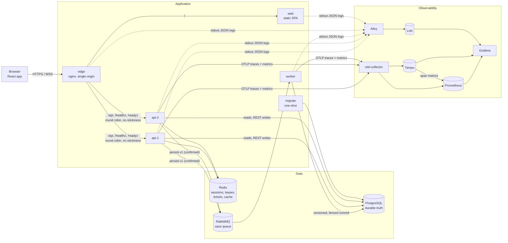
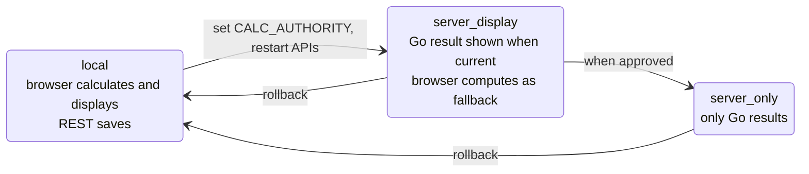
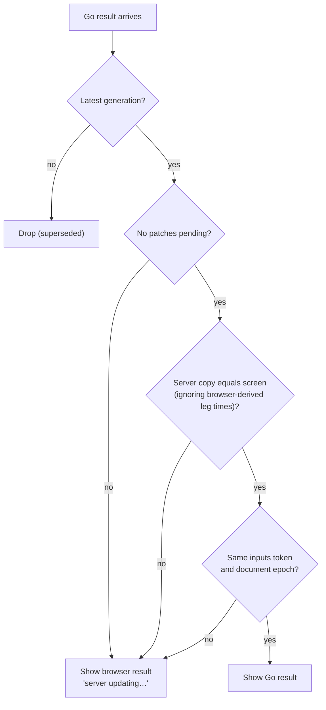
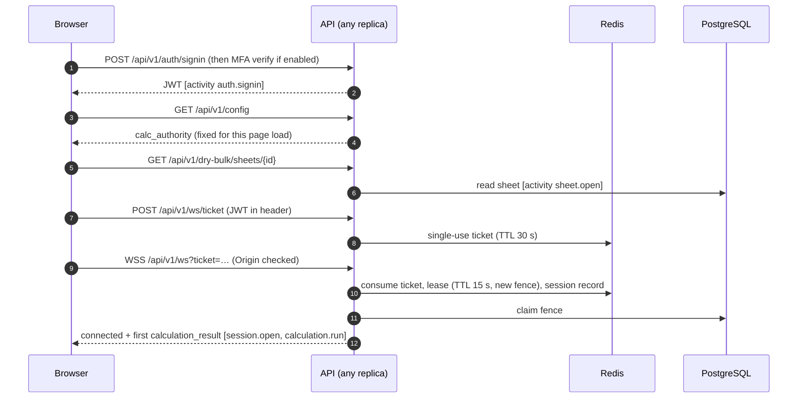
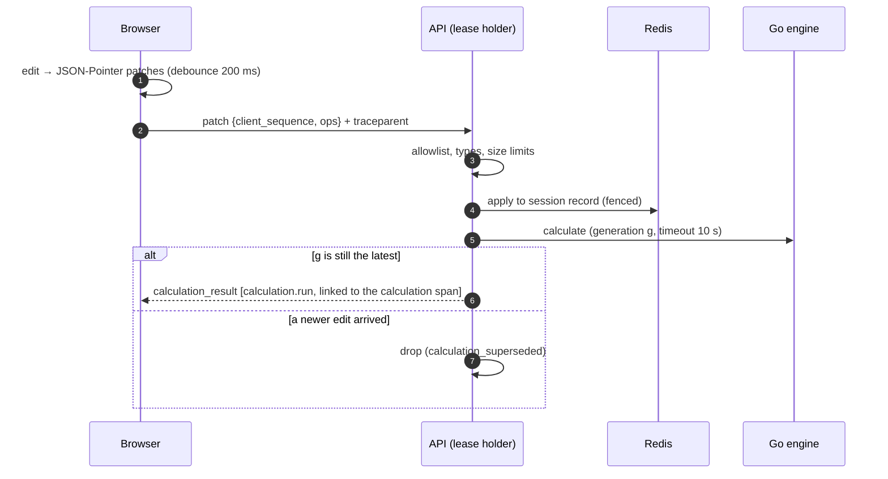
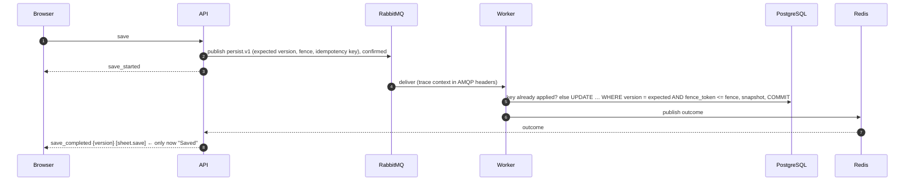
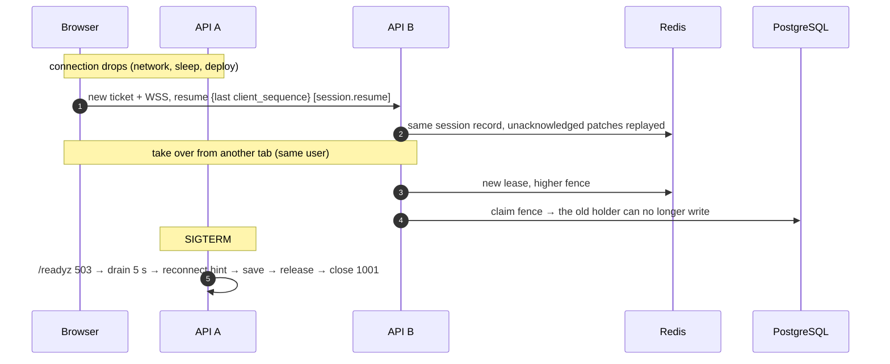
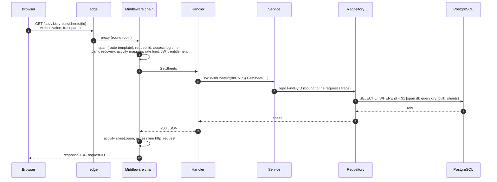
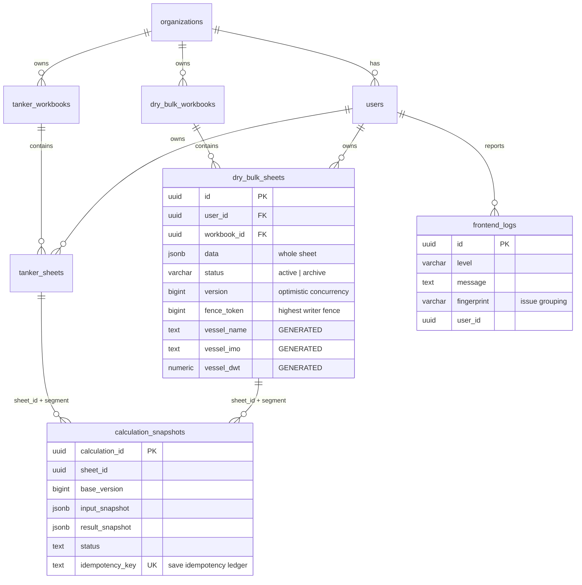
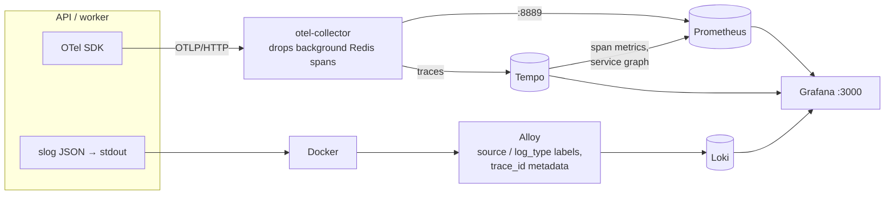

# Voyage Platform — Architecture

How the platform works end to end, as implemented: components, flows, the request journey down to SQL, data model,
logging and observability, timings, failure handling, security and operations. Only parts that run are described;
planned work is in [§13](#13-known-limitations-and-open-decisions).

The code is in three sibling repositories (cloned side by side):

| Repository | Contents |
|---|---|
| `NM-backend` | Go API and persistence worker (one module, two processes), calculation engine, migrations, backend docs |
| `NM-frontend` | React/Vite single-page app |
| `NM-Deploy` (this) | Docker Compose stack, edge proxy, observability configuration and dashboards, this document |

Decision numbers (D-nnn) refer to [NM-backend/docs/migration/DECISIONS.md](../NM-backend/docs/migration/DECISIONS.md).
Diagrams are Mermaid (they render on GitHub and in VS Code).

Contents

1. [System overview](#1-system-overview)
2. [Who owns what](#2-who-owns-what)
3. [Calculation authority stages](#3-calculation-authority-stages)
4. [Calculation session flows](#4-calculation-session-flows)
5. [Request journey (REST)](#5-request-journey-rest)
6. [Data model](#6-data-model)
7. [Logging](#7-logging)
8. [Metrics, traces and dashboards](#8-metrics-traces-and-dashboards)
9. [Timings and limits](#9-timings-and-limits)
10. [Failures and edge cases](#10-failures-and-edge-cases)
11. [Security and privacy](#11-security-and-privacy)
12. [Operations](#12-operations)
13. [Known limitations and open decisions](#13-known-limitations-and-open-decisions)

---

## 1. System overview

| Service | Scales | State | Purpose |
|---|---|---|---|
| `edge` | 1 (put TLS / a load balancer in front for production) | none | One origin for the browser: `/` → web, `/api` → API replicas (WebSocket included) |
| `web` | any | none | Serves the SPA (unprivileged nginx) |
| `api-1`, `api-2` | horizontally | **none between requests** | REST API, calculation WebSocket, session manager, Go calculation engine |
| `worker` | horizontally (idempotent) | none | Applies queued saves to PostgreSQL |
| `migrate` | once per deploy | none | Schema migrations (AutoMigrate + versioned SQL) and admin seed |
| `postgres` | 1 | **durable** | Sheets, workbooks, users, organizations, calculation snapshots, frontend logs |
| `redis` | 1 (single shard, D-031) | ephemeral | Sessions, leases, fence counters, tickets, rate limits, save outcomes, lookup cache |
| `rabbitmq` | 1 | durable queue | Save messages only (never UI traffic) |
| `otel-collector` | 1 | none | Receives OTLP; traces → Tempo, metrics → Prometheus; drops background Redis noise |
| `prometheus`, `loki`, `tempo` | 1 each | 15 d / 7 d / 7 d | Metrics, logs, traces |
| `alloy` | 1 | none | Ships every container's logs to Loki with `source` / `log_type` labels |
| `grafana` | 1 | provisioned | One UI for metrics, logs and traces; five dashboards |

One Go module builds two processes, the **API** and the **worker** (a modular monolith, D-039). The frontend is a
static build. All published ports bind to `127.0.0.1`.

---

## 2. Who owns what

| Concern | Owner | Never |
|---|---|---|
| "Saved" | **PostgreSQL commit** | A Redis update or a queued message is never "saved" |
| Authoritative calculation | **Go engine** (`NM-backend/internal/voyagecalc`) in server stages | Two competing engines; the browser engine is the `local` stage and a fallback |
| Unsaved edits | Browser + Redis session record | — |
| Who may edit a sheet | Redis **lease** with a strictly increasing **fencing token**, also checked by PostgreSQL | Sticky sessions as a consistency mechanism |
| Concurrent writes | `UPDATE … SET version = version + 1 WHERE id = $1 AND version = $2` | Last-writer-wins |
| Async durability | RabbitMQ + idempotent worker | RabbitMQ for UI messages |
| UI transport | WebSocket `ws.v1` (calculation sessions) and REST | — |
| Telemetry | OTLP (traces, metrics) and JSON on stdout (logs) | Sheet contents, bound SQL values, credentials in any signal |

---

## 3. Calculation authority stages

`CALC_AUTHORITY` on the API, served at `GET /api/v1/config`, read by the browser **once per page load** (D-059).

In `server_display` the Go result is shown only if it belongs to exactly the sheet on screen:

Server stages apply only where a live server session owns the sheet. Everywhere else (comparison page, read-only or
shared sheets, unsaved sheets, another tab editing) the browser result is used and labelled `local`.

---

## 4. Calculation session flows

### 4.1 Sign-in and opening a sheet (server stage)

### 4.2 Edit → result

### 4.3 Save (durable)

On demand, 5 s after the last edit, and when the sheet closes.

Failures: `VERSION_CONFLICT` and `STALE_FENCE` are final (activity outcome `conflict`). Transient database errors are
retried (2 s, up to 5 attempts), then dead-lettered → `save_failed`.

### 4.4 Reconnect, takeover, shutdown

---

## 5. Request journey (REST)

Every HTTP request runs through the same chain. A request's trace connects its access log line, activity event,
every SQL statement it runs, and the browser's log lines about that call.

What each step records:

| Step | Trace | Log line (`log_type`) |
|---|---|---|
| Request arrives | HTTP span `GET /api/v1/dry-bulk/sheets/:id` (continues the browser's `traceparent`) | — |
| Every SQL statement | child span `db <op> <table>`: `db.query.text` with `$n` placeholders, rows | `db_slow_query` (> 200 ms, WARN) or `db_query_failed` (ERROR), on the same trace |
| Handler error | span status | `error` field on the access line (the handler's `c.Error`) |
| Panic | span failed | `panic_recovered` (kind + stack frames, ERROR); 500 with a fixed body |
| User action (mapped routes) | — | `user_activity` (`activity`): event, outcome, ids |
| Response | span ends | `http_request` (`access`): method, route, status, duration, bytes, user, request id |

**Context propagation.** Handlers bind services and repositories with `WithContext(dbCtx(c))`, so every statement runs
with the request's span. `dbCtx` carries the trace but not the client's cancellation: a write completes as before when
a client disconnects (D-061).

**Failure paths:** 401/403 → `denied` activity outcome and WARN access line. 409 → `conflict`. 4xx → `failure`.
5xx → ERROR access line with the cause, `error` outcome. A failing statement → `db_query_failed` with the database
error (never the bound values). A panic → `panic_recovered`.

---

## 6. Data model

Each sheet is **one row with its JSON** (`data`). Cargo, legs and bunkers are not split into tables (D-060).

- Dry bulk and tanker never mix: separate sheet and workbook tables.
- `vessel_name`, `vessel_imo` and `vessel_dwt` are STORED generated columns, used for analytics. They cannot drift and
  never make a save fail.
- `calculation_snapshots` is also the save idempotency ledger. Never delete its rows.
- `frontend_logs` backs the admin log viewer. The same events also reach Loki (§7).

---

## 7. Logging

Every container writes to stdout. The API and worker write **one JSON object per line**, using Gin in release mode,
JSON panic recovery, and SQL logged through `slog`. Alloy ships everything to Loki and labels each line:

| Label | Values | Meaning |
|---|---|---|
| `source` | `backend` | API and worker logs |
| | `frontend` | Browser logs, ingested through `POST /api/v1/logs` |
| | `infrastructure` | edge, web, PostgreSQL, Redis, RabbitMQ, observability |
| `log_type` | `access`, `activity`, `db`, `app`, `frontend` | What the line is (below) |
| `level` | `debug`, `info`, `warn`, `error` | |
| `service`, `container` | compose names | |

`trace_id`, `span_id` and `request_id` are **structured metadata**: indexed for exact lookup, and they power the
log ↔ trace links. Every other field stays in the JSON line (`| json` in LogQL).

| `log_type` | Message | One line per | Key fields |
|---|---|---|---|
| `access` | `http_request` | HTTP request | method, route, path, status, duration_ms, bytes_out, user_id, organization_id, request_id, error, slow |
| `activity` | `user_activity` | user journey event | event, outcome, user_id, organization_id, segment, sheet_id / workbook_id / target_*, client_ip (auth only) |
| `db` | `db_slow_query`, `db_query_failed` (`db_query` with `DB_LOG_LEVEL=info`) | slow / failed SQL statement | sql (placeholders), rows, duration_ms, error |
| `frontend` | the browser's message | browser event | frontend_level, component, action, page, url_path, browser_session_id, user_id, fingerprint, stack (errors), trace_id |
| `app` | anything else | — | e.g. `panic_recovered`, startup, worker lifecycle |

Levels: ERROR = 5xx, failed SQL, failed save or calculation, panic, browser errors. WARN = 4xx, slow request
(> 500 ms) or SQL (> 200 ms), denied or conflicting actions. INFO = the rest.

### User activity

The backend records the user journey authoritatively: it can't be blocked by ad blockers or faked by the browser. Each
event is a log line plus the `user_activity{event,outcome}` metric.

| Area | Events |
|---|---|
| Authentication | `auth.signin` (`success`, `mfa_required`, `denied`), `auth.mfa_verify`, `auth.mfa_resend` |
| Account | `account.mfa_setup`, `account.mfa_enable`, `account.mfa_disable` |
| Sheets, workbooks | `sheet.open`, `sheet.save`, `sheet.archive`, `sheet.restore`, `workbook.create` / `.open` / `.update` / `.archive` / `.restore` |
| Calculation session | `session.open`, `session.resume`, `calculation.run`, `sheet.save` (`via=websocket`), `session.conflict`, `session.error`, `session.close` |
| Reference data | `reference.stowage_factor.create` / `.update` / `.delete` |
| Administration | `admin.user.*`, `admin.organization.*`, `admin.sheets.view`, `admin.cache_clear` |

Outcomes: `success`, `failure` (4xx), `denied` (401/403), `conflict`, `error`, `mfa_required`.

The browser adds UI-only events that the server can't see, such as exports, view changes, imports and regulatory
toggles (`trackEvent`). These arrive as `log_type=frontend` lines with `kind=activity`.

### Frontend logs

The browser buffers log entries (errors, unhandled rejections, failed or slow API calls, UI events), persists them in
`localStorage`, and uploads them in batches to `POST /api/v1/logs`. The API stores them in PostgreSQL for the admin log
viewer, **and** writes each as a `log_type=frontend` line, which Alloy labels `source=frontend`.

Same-origin API calls carry a W3C `traceparent`. A failed or slow call is logged with that `trace_id`, so a browser
error opens the backend trace of the same call.

---

## 8. Metrics, traces and dashboards

- **Metrics** (Prometheus, 15 d):
  - Application metrics from the OTel SDK: calculation, WebSocket, saves, conflicts, worker, RabbitMQ, PostgreSQL,
    Redis, and `user_activity`.
  - HTTP metrics from `otelgin`.
  - Span metrics and the service graph, derived by Tempo.
  - Each replica has its own `instance` label (`OTEL_RESOURCE_ATTRIBUTES=service.instance.id=…`).
- **Traces** (Tempo, 7 d): browser `traceparent` → HTTP or WebSocket span → calculation → RabbitMQ → worker →
  PostgreSQL. Successful background Redis calls with no parent span are dropped at the collector; failed ones are kept.
- **Logs** (Loki, 7 d): see §7.

Grafana dashboards (folder **Voyage Platform**; generated by `deploy/observability/grafana/gen-dashboards.cjs`):

| Dashboard | Shows |
|---|---|
| **Overview (metrics)** | Calculation rate and latency, WebSockets and sessions, saves and conflicts, worker and RabbitMQ, PostgreSQL and Redis latency, HTTP routes, service graph, error and slow traces |
| **Backend logs** | Errors, warnings, 5xx, slow requests, failed SQL, panics; volume by log type; failing and slowest routes; slow/failed SQL statements; a filterable stream (service, log type, level, text) |
| **Frontend logs** | Browser errors, failed API calls seen by browsers (linked to backend traces), sessions, UI events by action, top errors, stream |
| **User activity** | Active users, sign-ins and failures, sheets opened, calculations, saves; events and unsuccessful outcomes over time; most active users; failed sign-ins by IP; admin actions; one user's journey |
| **Request journey** | Paste a trace id or request id: the access line, every backend and browser log line of the trace, its SQL statements (`db.query.text`, rows), and the full trace |

Links between signals:

- **Log → trace:** "View trace" on any line with a `trace_id`.
- **Trace → logs:** "Logs for this trace" queries `{source=~"backend|frontend"} | trace_id="…"`.
- **Trace → metrics:** span metrics for the span.

---

## 9. Timings and limits

| Item | Value |
|---|---|
| Patch debounce (browser) | 200 ms |
| WS ticket | 30 s, single use |
| Lease TTL / renew | 15 s / 5 s |
| Heartbeat / idle timeout | 20 s / 60 s |
| Calculation timeout | 10 s (`WS_CALC_TIMEOUT`) |
| Idle auto-save | 5 s after the last edit |
| Session record idle TTL | 30 min |
| Worker | prefetch 8, apply timeout 10 s, 5 attempts, retry delay 2 s |
| Message / voyage size | 64 KiB per WS message; ≤ 200 sequence rows, ≤ 50 cargoes |
| Slow request / slow SQL | 500 ms / 200 ms (`DB_SLOW_QUERY_MS`) |
| Frontend log upload | every 5 s, ≤ 25 entries per request, ≤ 500 buffered |
| Shutdown | drain 5 s, timeout 20 s, container grace 35 s |
| Edge WS idle timeout | 75 s |
| PostgreSQL connections | 25 per process; `max_connections=150` |

---

## 10. Failures and edge cases

Every row is covered by automated tests; the test-by-test list is in
[NM-backend/docs/migration/FAILURE_MATRIX.md](../NM-backend/docs/migration/FAILURE_MATRIX.md).

| Area | Case | Behaviour | Where it shows |
|---|---|---|---|
| Connection | Drop, sleep, deploy | Unsaved edits saved on close; client resumes with backoff (immediately on `online`/visible) | `session.close`, `session.resume` |
| | Out-of-order / duplicate patch | Rejected / re-acknowledged; nothing applied twice | `session.error` |
| | JWT expires mid-session | Close 4401, re-ticket, resume | `session.error` `UNAUTHORIZED` |
| Tabs | Second tab | Read-only with "Take over"; the old holder's next write → `STALE_FENCE`, close 4409 | `session.conflict` |
| | Two saves from one base | One wins, the other `VERSION_CONFLICT` (never last-writer-wins) | `sheet.save` `conflict`, `version_conflicts_total` |
| Redis | Down / slow | Fail closed (`UNAVAILABLE`, retryable); REST saves 503 without writing; bounded by a 5 s timeout | ERROR access lines, `redis_latency` |
| | Lease expired | Next holder takes it with a higher fence; the stale holder is rejected by Redis and PostgreSQL | `lease_conflicts_total` |
| RabbitMQ | Down at save | `save_failed` (retryable); edits stay in the session | `sheet.save` `error` |
| | Duplicate delivery / worker killed before ack | Applied at most once (idempotency key) | `worker_failures_total` |
| PostgreSQL | Slow / down | Retried, then dead-lettered with `save_failed`; never half-written | `db_query_failed`, `worker_failures_total{kind="dead_letter"}` |
| Calculation | Invalid patch / oversized | `INVALID_PATCH` naming the path, never the value | `session.error` |
| | Timeout / engine panic | `CALCULATION_TIMEOUT` / `CALCULATION_FAILED`; the session continues; no input values logged | `calculation.run` `error`, `calculation_errors_total` |
| REST | Handler panic | 500 with a fixed body | `panic_recovered`, ERROR access line |
| | Unknown route / bad input | 404 / 400 | WARN access line, `failure` outcome |
| API | Replica restart | Readiness 503 → drain → save → 1001; resume on the other replica | `/readyz`, `session.resume` |
| Config | `CALC_AUTHORITY` changed | Applies on the next page load | — |
| | URL other than `PUBLIC_ORIGIN` | WebSocket refused (origin check) | WARN access line on `/api/v1/ws` |
| Browser | Offline / logs endpoint down | Logs stay in `localStorage`, retried with backoff | — |

---

## 11. Security and privacy

- **Authentication:** JWT (with optional MFA) in the `Authorization` header. The WebSocket uses a short-lived,
  single-use ticket, never the JWT, in its URL.
- **Authorization** is checked server-side on every request and patch: organization, sheet, segment and lease
  ownership.
- **Patch allowlist:** only listed JSON-Pointer paths, with types and size limits.
- **Secrets** live only in `.env` (gitignored) or a secrets manager, injected at runtime. They never appear in images,
  the JS bundle (the build fails its bundle scan), URLs, logs or responses. Grafana requires `GRAFANA_ADMIN_PASSWORD`.
- **What telemetry never contains:**
  - sheet contents or bound SQL values (filtered for logged statements and for `.Scan()` statements; D-062);
  - credentials or tickets (query values redacted);
  - emails (ids only);
  - panic argument values.
  - The client IP is recorded only on authentication events (security audit, D-061).
- **Network:** every published port binds to `127.0.0.1`. Alloy reads the Docker socket read-only; in production use
  the platform's log agent.
- **Containers** run as non-root (API/worker uid 10001, web uid 101).

---

## 12. Operations

| Task | Command (in NM-Deploy) |
|---|---|
| Start / rebuild after pulling code | `docker compose up -d --build --wait` |
| Status | `docker compose ps` |
| Raw logs of one service | `docker compose logs -f api-1` (or Grafana → Backend logs) |
| Apply a `.env` change | `docker compose up -d` |
| Run the API from source against the stack's databases | `docker compose -f docker-compose.yml -f compose.dev.yml up -d postgres redis rabbitmq` |
| End-to-end check | `cd ../NM-backend && SMOKE_EMAIL=… SMOKE_PASSWORD=… go run ./cmd/smoke -base http://127.0.0.1:8080` |
| Regenerate dashboards | `node deploy/observability/grafana/gen-dashboards.cjs` (then `docker compose restart grafana`) |
| Roll back the last DB migration | `docker compose run --rm migrate -migrate-down 1` |
| Stop (keep data) | `docker compose down` |

Settings reference: [NM-backend/docs/DEPLOYMENT.md](../NM-backend/docs/DEPLOYMENT.md). Production target:
[deploy/production/README.md](deploy/production/README.md).

---

## 13. Known limitations and open decisions

| Item | Status |
|---|---|
| Production topology (TLS, managed PostgreSQL, Redis/RabbitMQ HA, backups) | Open; compose runs single nodes |
| `server_only` stage | Implemented, not enabled; needs approval |
| Removing browser calculation code (stage 5) | Deferred, per domain, needs approval (D-058) |
| Fresh databases lack `tanker_sheets` and the read-only import tables | Created only by the manual SQL in `NM-backend/migrations/`; AutoMigrate does not create them |
| Sheet list endpoints return full `data` | Works; heavier as sheets grow (API change, pending decision) |
| `calculation_snapshots` keeps a full copy per save | Payload retention pending decision |
| Activity and log retention | 7 days in Loki; longer audit retention would need a decision (PostgreSQL keeps frontend logs) |
| Sea-route service (`SEAROUTE_SERVICE_URL`) | External, not part of the stack |
| Unused functions in `internal/voyagecalc` (3) | Kept: engine changes need a parity review |
